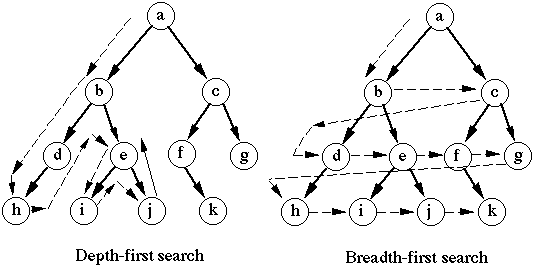

# Data Structures (part 2)

## Trees and Graphs

---

# Content
- Recap
- Nodes
- Trees
- Tree traversal
- Graphs
- Graph representation
- Dijkstra
- (Heaps)

---

# Recap
## Big O notation

O($n$) where $n$ is the order of the input
```python
for i in list:
	#do something
n = len(list)
```
O($n^2$)
```python
for i in list:
	for i in list:
    		#do something
```
O($n^2$) + O($n$) $=$ O($n^2$)


---
# Nodes
- value
- pointer


```
class node:
    def __init__(self):
        self.data = None # contains the data
        self.next = None # contains the reference to the next node
```

---

---
# Data structures
## Linked lists, stack and queue

A stored link list contains just the head:
```
class LinkedList:
    def __init__(self, head):
        self.head = head # contains the first node in the list
```
---
## Stack and queue
- In Python
- Complexity


---

## Hashmap and Set
- In Python
- Complexity
- --

|                       | array list (list) | queue | stack | hash map (dict) | set |
|:---------------------:|:-----------------:|:-----:|:-----:|:---------------:|:---------------:|
|      add element      |        O(1)       |  O(1) |  O(1) |       O(1)      |O(1) |
|     remove element    |        O(n)       |  O(1) |  O(1) |       O(1)      | O(1)|
| find element at index |        O(1)       |  O(n) |  O(n) |      -      | - |
| find element          |        O(n)       |  O(n) |  O(n) |       O(1)      |O(1) |

---
# Trees
Binary tree:              

 

---
# Trees
## Implementation in python
```
class BinaryTreeNode:
    def __init__(self, data):
        self.data = data # contains the data
        self.left = None # contains the reference to the left child
        self.right = None # contains the reference to the right child
```
```
class TreeNode:
    def __init__(self, data):
        self.data = data # contains the data
        self.children = [] # contains a list with children
```
---
# Try yourself!
`input:` the root of a binary tree

`output:` a list containing all nodes by level, starting from the root.


`result: [2, 7, 5, 2, 6, 9, 5, 11, 4]`

---
# BFS & DFS
- **Breadth first search**
Start with the closest nodes first
- **Depth fitst search**
Start with one node and go as deep as possible into its children

---
# BFS & DFS
## Implementations
```
class TreeNode:
    def __init__(self, data):
        self.data = data # contains the data
        self.children = [] # contains a list with children
```
---
# Implementation
## BFS
```
import queue
def bfs_path(root):
    path = list()
    node_queue = queue.Queue()
    node_queue.put(root)
    while not node_queue.empty():
        node = node_queue.get()
        path.append(node.data)
        for child in node.children:
            node_queue.put(child)
    return path
```
---
# Implementation
## DFS
```
def dfs_path(root):
    path = list()
    node_stack = list()
    node_stack.append(root)
    while len(node_list) > 0:
        node = node_stack.pop()
        path.append(node.data)
        for child in node.children:
            node_stack.append(child)
    return path
```

---
# Graphs
Every tree is a graph, but not every graph is a tree.
A tree is just a non cyclic graph.

]

---
# Traversal in graphs
What should we do differently if there can be cycles in our tree?
```
root = GraphNode(0)
child1 = GraphNode(1)
child2 = GraphNode(2)
root.children = [child1]
child1.children = [child2]
child2.children = [root]
```
---
# Traversal in graphs
*What should we do differently if there can be cycles in our tree?*

Keep track of visited nodes!
- keep track of visited nodes
- Before adding children to the stack/queue, check whether we have already visited this child

What would be a good data structure for this?

---
# BFS in a graph
```
def bfs_path(root):
    path = list()
    node_queue = queue.Queue()
    node_queue.put(root)
    visited = set()
    while not node_queue.empty():
        node = node_queue.get()
        visited.add(node)
        path.append(node.data)
        for child in node.children:
            if child in visited:
                continue
            node_queue.put(child)
    return path
```
**Voorbeeld in pycharm**

---
# More about Graphs
### Directed vs undirected


---

# More about Graphs
### Weighted vs unweighted


---
# More about Graphs
### Storing a graph

1.  Nodes as objects and edges as pointers (reaching a node is O(n), good for sparse, directed graphs)
- A list of edges between numbered nodes (reaching an edge is O(n), good for sparse, undirected graphs)
- A matrix containing all edge weights between numbered node x and node y (reaching an edge is O(1), good for big, directed and undirected graphs)


---

# Application
### Trees?
### Graphs?
---
# Application
### Trees
- File system
- Sorting of sorted Data
- Manipulate Hierarchical Data
- Faster Lookup

### Graphs
- Social relations (facebook)
- Maps (google maps, shortest path, Dijkstra)
- Recommendations ("you might also like..")

---
# Dijkstra
*For a given source node in the graph, the algorithm finds the shortest path between that node and every other.*

**Its just like BFS**

[explanatory youtube video](https://www.youtube.com/watch?v=gdmfOwyQlcI)

 ---
 # Dijkstra
Itterate until you store the node you want to find the shortest path to, every iteration:
- Look at all the edges you can reach
- Store the smallest distance
- Update all edges that are adjecent to the smallest distance


---
# Heaps?
[Only the best datastructure ever! ](https://www.cs.cmu.edu/~adamchik/15-121/lectures/Binary%20Heaps/heaps.html)
